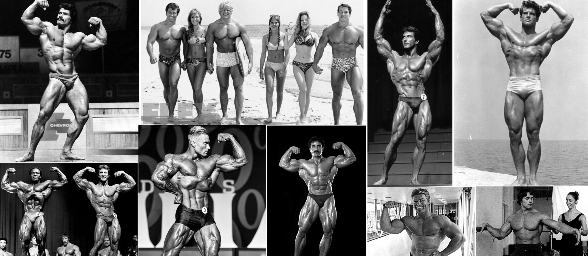

 

  
 
    <h1>УП02: Учебная практика по интеграции программных модулей</h1> 
  
 
  

  
	
	

   <a>Практика посвящена модулю ПМ02 "Осуществление интеграции программных модулей".  Тема моего проекта: "Проектирование и разработка базы данных для спортивных соревнований".</a> <a>Код программы был взят с моего старого репозитория на GitHub: 
   <a href="https://github.com/K1rsN7/Competition-organization">Competition-organization</a>.
   </a>
  
 
    <h2>Введение в тему.</h2> 
  
 
  <a>Путь бодибилдинга и фитнеса можно проследить до древней Греции с её античными скульптурами. На протяжении всей истории, особенно в древние времена, существовал интерес к физической силе и её влиянию на здоровье человека. Наибольшей популярностью этот спорт пользовался с конца 1970-х до начала 1990-х годов. Это была эпоха гигантов, которые раздвинули границы человеческой силы и физики, вдохновляя бесчисленное количество людей следовать их примеру. В настоящее время бодибилдинг является одним из самых популярных видов спорта. По всему миру проводятся множество региональных и международных соревнований для мужчин и женщин.</a> 
  
 
    <h2>Проблематика.</h2> 
  
 
  <a>С появлением информационных технологий бодибилдинг стал известен более широкой части населения. Многие люди начали узнавать о предстоящих событиях, следить за ними и получать информацию о результатах через Интернет. Однако не существует единой системы для организации и проведения соревнований. Существует также высокий риск фальсификации результатов соревнований.</a> 
  
 
    <h2>Цель проекта.</h2> 
  
 
  <a>Цель проекта — разработать настольное приложение для организации соревнований по бодибилдингу.</a> 
  
 
    <h2>Что в итоге?</h2> 
  
 
  <a>Результатом проекта является разработанное и функционирующее настольное приложение для организации соревнований по бодибилдингу. Приложение позволяет оптимизировать время работы организатора, члена жюри и спортсмена; избавляет их от "бумажной работы" и фальсификации результатов соревнований. Также оно предоставляет возможность ознакомиться с информацией о соревнованиях и спортсменах простым пользователям системы. Кроме того, приложение имеет ярко выраженный стиль бодибилдинга.</a> 
  
 
    <h2>Инструкция по запуску сервера</h2> 
  
 
  <a>Для запуска сервера выполните следующие шаги: 
  <ol> 
    <li>Перейдите в папку <code>database</code>.</li> 
    <li>Выполните команду: <code>docker-compose up</code>.</li> 
    <li>После успешного запуска сервера запустите программу.</li> </ol> </a>
    

<h2 align="center"> Star History</h2>
<a href="https://star-history.com/#K1rsN7/Iron_Event&Date">
 <picture>
   <source media="(prefers-color-scheme: dark)" srcset="https://api.star-history.com/svg?repos=K1rsN7/Iron_Event&type=Date&theme=dark" />
   <source media="(prefers-color-scheme: light)" srcset="https://api.star-history.com/svg?repos=K1rsN7/Iron_Event&type=Date" />
   
 </picture>
</a>
